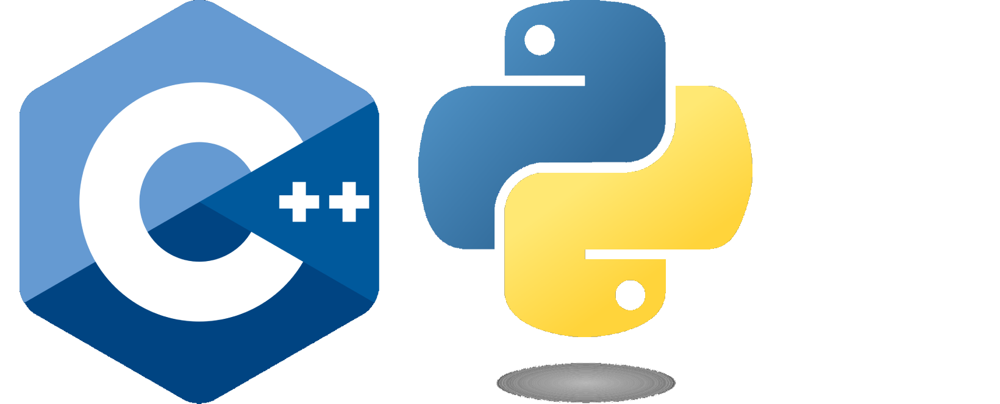
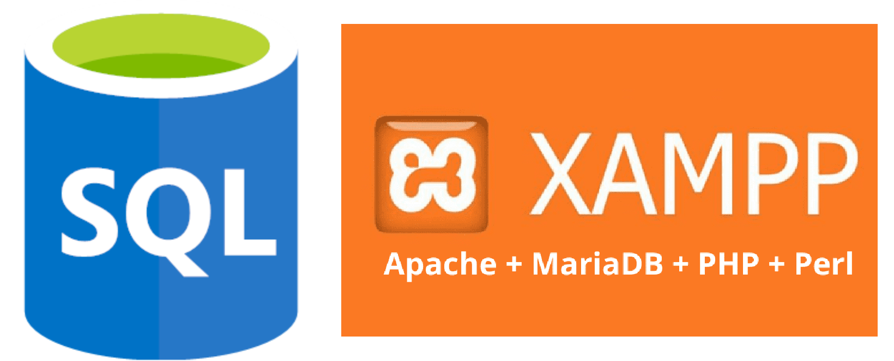

 
# ¡Hola!

Soy **Feliciano José Palacios Oscata**, un entusiasta estudiante de **Ingeniería de Sistemas e Informática** en la **Organización Educativa Continental**. Este repositorio contiene una colección de mis proyectos y trabajos que reflejan mis habilidades y conocimientos en el campo de la programación y el desarrollo de software.

## Información de Contacto

- **GitHub:** [Palacios1996](https://github.com/Palacios1996)
- **Correo Electrónico:** [76757361@continental.edu.pe](mailto:76757361@continental.edu.pe)
- **Ubicación:** Lima, Perú

## Sobre Mí

Soy un apasionado por la tecnología y la resolución de problemas. Estoy constantemente aprendiendo y mejorando mis habilidades en programación, desarrollo de aplicaciones y diseño de sistemas. Mis áreas de interés incluyen:

- **Programación en**

  
  
- **Bases de Datos**

  

## Contribuciones

Estoy abierto a colaboraciones y siempre busco aprender de otros. Si tienes ideas o proyectos en los que crees que podría aportar, ¡no dudes en contactarme!

## Agradecimientos

Gracias por visitar mi portafolio. Espero que podamos conectar en el futuro.
